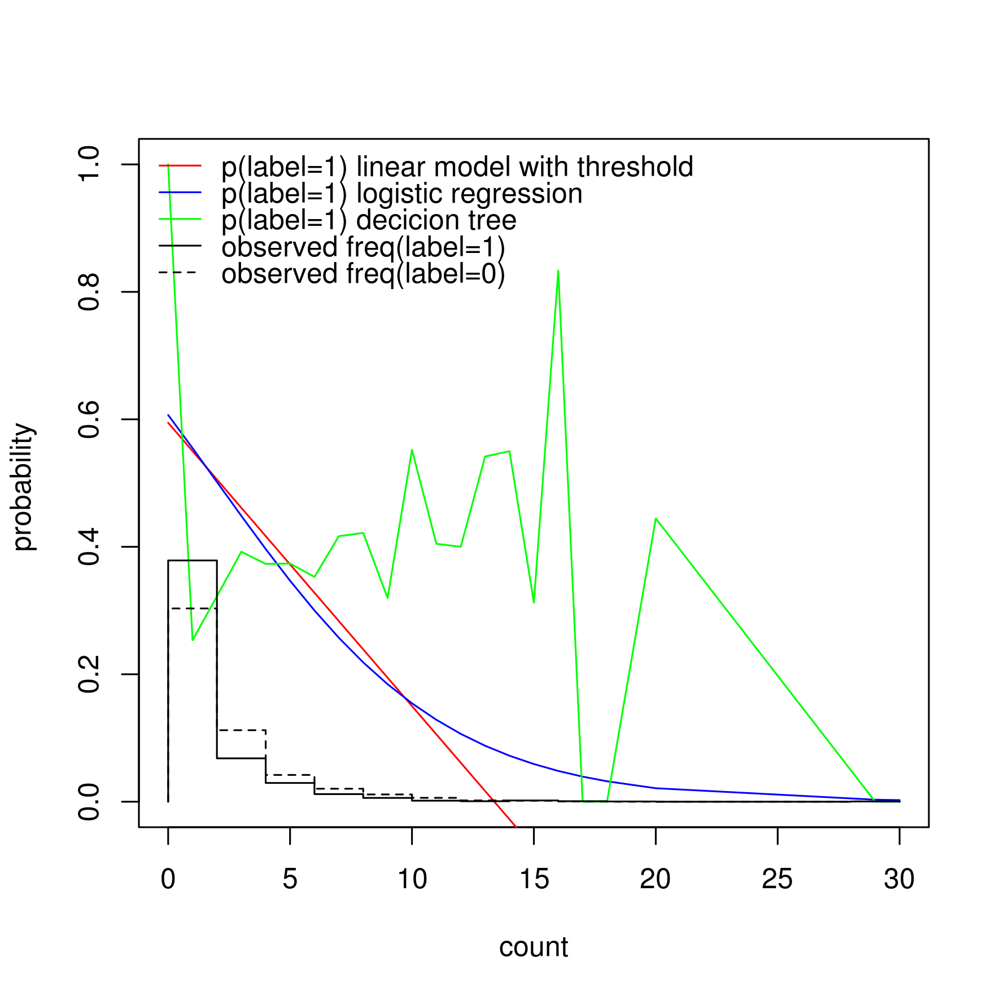
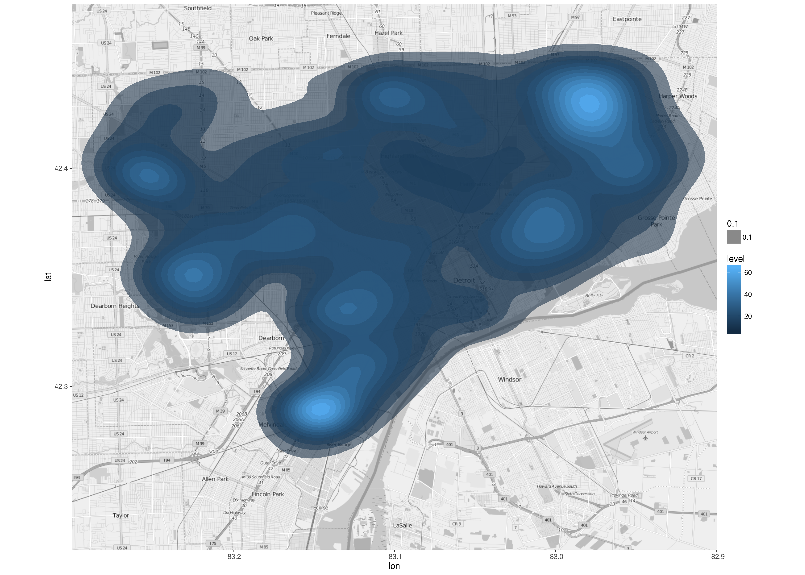
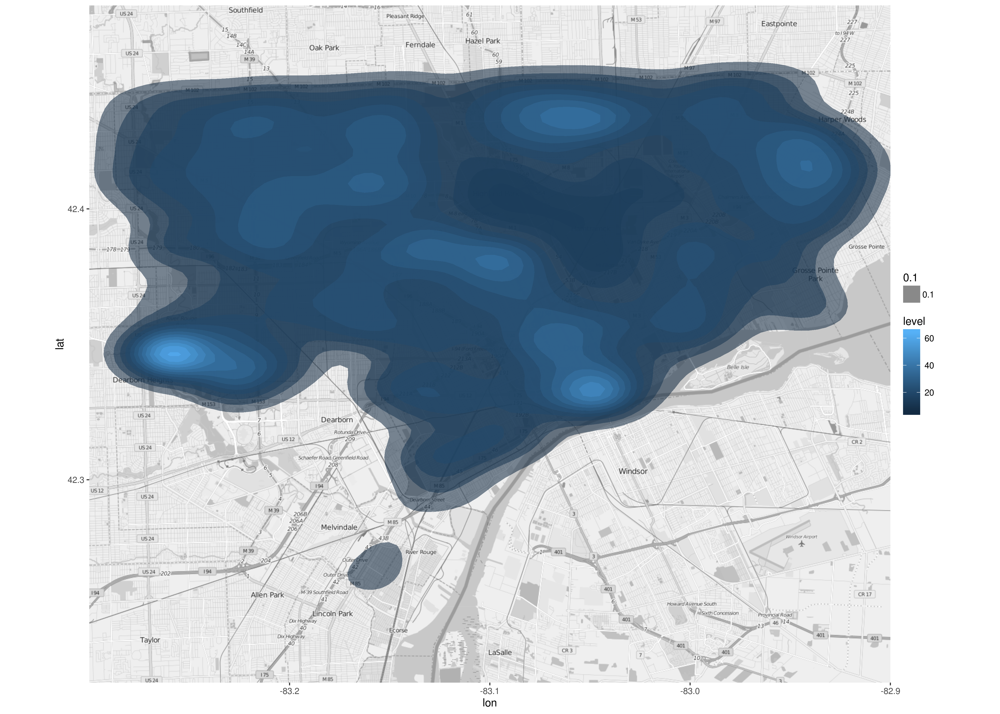
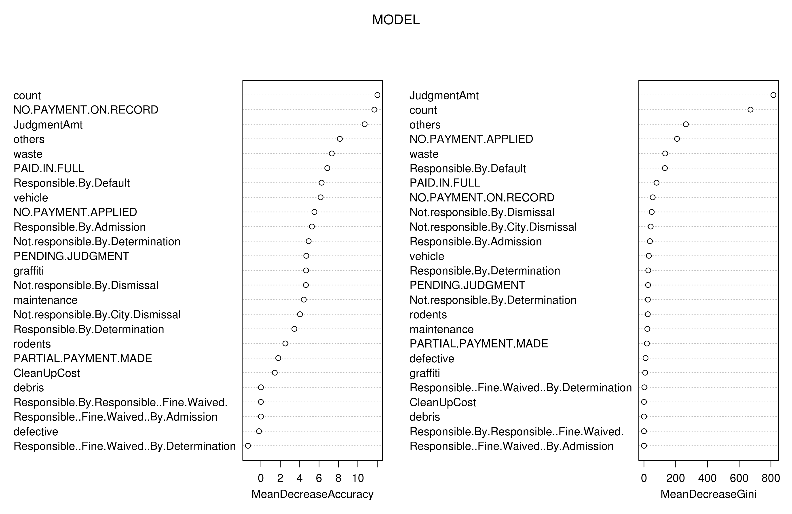

Predicting blight buildings (R,dplyr,ggmap,tree,randomForest,rpart,party,e1071/svm,xgboost) 

# Summary

- Method does not matter with this data size and feature set
- Accuracy was around 0.76 for almost all models, even such contratsing like logistic regressions and random forests. So there is still a need for more features.
- False positve rate almost zero, false negative rate much higher. This might result from pending desicions about any demolitions.
- Though there are violations, calls and crimes in the city center, these huge buildings were obviously not removed. Filtering these buildings might improve prediction.

# INTRODUCTION
### Preface

Unfortunately this course started during very busy weeks. So my submission is somehow unsorted and I did not have the time to set up a proper code repository. Even more important, I could not get all models tuned. Nevertheless, this course was a great experience for me, I learned a lot! Code and maps might be made available on request.

### Objectives
Predict blight status using  data about demolition permits, violations, calls on 311 and crimes.


*green=calls blue=violations red=permits orange=crimes*

# MATERIALS AND METHODS

### Data processing

Records of buildings were cleaned for double blanks and converted to uppercase. Using regular expressions, abbreviations for Detroit and Michigan and a like were removed, to refine the appropriate fields to just a house number and a street name. All distinct resulting text entities were taken as buildings per definition. When several coordinates were given, a kind of size was calculated, but this approach could not be finished.
All data where restricted to a bounding box (42 to 43 / -83.3 to -82.9). Coordinates were double-checked for consistancy. Violations often had the same locations at the center of Detroit (42.33168N -83.04800W) presumably when real coordinates were not known. These coordinates were taken from the Google Maps API. Data on permits, calls and crimes have been in better shape.
Violations, calls and crimes were counted per building. Moreover, using regular expressions, different types of violations were extracted and also accumulated per building. 
In order to improve prediction, amounts of dollars for fines, fees and costs were aggregated each, and finally 'PaymentStatus' and 'Disposition' were converted into a one-hot-encoded matrix.
For modeling, records of 6355 blighted and 6355 unlabelled buildings were taken. This dataset was divided into five parts of equal size using 4 for training and 1 for testing on each turn of cross-validation.  If not denoted otherwise, values presented are averages of such five values of accuracy. 


### Software
Mainly R 3.2.2 with libraries base, stat, dplyr for data managment. ggmap was used for visualisations and tree,rpart,party,randomForest, svm, adabag and xgboost for a comparative analysis in accuracy and performance. Logistic regression and Random Forests were also compared with python3 and sklearn.

# RESULTS

### Counts of violations (total and categorized)

Three different sets of predictors were copared using a linear model (stat::lm) with threshold, a logistic regression (stat::glm, family="binomial") and a decision tree (tree::tree) using fivefold cross-validation. Some scripts were developed to model, evaluate and iterate over cross-validation steps. Using three methods, the following model fits were performed to predict the probability to get a set label.

```
label ~ count
label ~ graffiti + defective + otherspart
label ~ graffiti + defective + debris + waste + vehicle + rodents + maintenance + others


Linear model with threshold

Accuracy  Threshold AOC
0.7603191 0.5900000 0.7277253 
0.7600907 0.5880000 0.7278987 
0.7596253 0.5880000 0.7330755 

Logistic Regression

Accuracy  Threshold AOC
0.7603191 0.6060000 0.7257294 
0.7601713 0.6040000 0.7266628 
0.7594688 0.5980000 0.7335230 

Decision tree

Accuracy  Threshold AOC
0.7608670 0.7980000 0.7944847 
0.7604864 0.7680000 0.7942775 
0.7598032 0.7540000 0.8010996 
```

Accuracies do not differ that much. The simple count of total violations per building always performed best.


*Linear and logistic regression and decision tree compared to observed frequencies*

### Performance Comparisons

The following formulas were timed using a provided function for fivefold cross validation for all methods in the same way. 
Accuracies were calculated as a simple average.

```
factor~count
factor~graffiti+defective+otherspart
factor~count+graffiti+defective+otherspart
factor~graffiti+defective+debris+waste+vehicle+rodents+maintenance+others
factor~count+graffiti+defective+debris+waste+vehicle+rodents+maintenance+others

Package tree -- 5.695 sec
0.7591152
0.7588071
0.7584309
0.7531628
0.7539395

Package rpart -- 4.282 sec

0.7588856
0.7584099
0.7591909
0.755628
0.7553717

Package party / ctree -- 4.098 sec
0.7603191
0.7598479
0.7598479
0.7581524
0.7602411
4.098 sec

Package randomForest -- 81.282 sec
0.7590399
0.7593781
0.7596148
0.5551295
0.7597703
81.282 sec

Package ada -- 289.197 sec
0.7603191
0.7598479
0.7603191
0.7544382
0.7601662

Package adabag -- 156.528 sec
0.7603191
0.7598479
0.7601662
0.7549111
0.7500371

Package xgboost -- 8.388 sec
0.7590399
0.7590546
0.7588204
0.7520624
0.7538035
```

Logistic regression 'glm', decision tree 'ctree' and 'xgobust' were therefore good methods to compare features.


### Counts of violations, crimes, calls


*Density of permits*


*Density of violations*


*Density of calls*


*Density of crimes*


There is a huge discrepancy around the center of the city in counts on violations and demolition permits.

Prediciting probability of blight using simple methods and thresholds:

```
label~count
label~callcount         # poor predictor
label~crimecount        # poor predictor
label~count+callcount
label~count+crimecount
label~count+callcount+crimecount


linear      logistic    tree    
18.107 sec  19.934 sec  13.756 sec  
0.7603191   0.7603191   0.7603191   
0.5085665   0.5085665   0.5085665   
0.5078368   0.5078368   0.5078368   
0.7582604   0.7582604   0.7582604   
0.7592817   0.7593596   0.7593596   
0.757223    0.7573009   0.7573009   
```
 
Predicting labels with more sophisticated methods. In R a categorial variable (“factor”) is used as target:
           
```
factor~count
factor~callcount  # poor predictor
factor~crimecount # poor predictor
factor~count+callcount
factor~count+crimecount
factor~count+callcount+crimecount


tree    	rpart   	ctree   	randomForest
5.148 sec   2.056 sec   3.263 sec   65.829 sec
0.7591152   0.7588856   0.7603191   0.7590399
0.5045895   0.5046689   0.5046689   0.5045895
0.4948261   0.4949818   0.4946681   0.4983678
0.758486    0.7588856   0.7603191   0.7603191
0.7587334   0.7587297   0.7603191   0.760322
0.7582499   0.7587297   0.7603191   0.7603191
```

Some models fail, as counts of calls and crimes are poor predictors, but generally, accuracies of all methods are comparable for these data.

### Comparison with sklearn on python3

```
LinearRegression
label ~ count   							accuracy: 0.75941339675
label ~ count + keywords   					accuracy: 0.759809750297

LogisticRegression (WRONG USAGE SO FAR!)
label ~ count   							accuracy: 0.575137686861
label ~ count + keywords   					accuracy: 0.609756097561
label ~ count + callcount + crimecount   	accuracy: 0.621557828482

LinearDiscriminantAnalysis
label ~ count   							accuracy: 0.57513768686073963
label ~ count + callcount + crimecount   	accuracy: 0.75735590487706572

RandomForestClassifier
label ~ count   							accuracy: 0.57758968158000801
label ~ count + keywords	   				accuracy: 0.7574316290130797
label ~ count + callcount + crimecount   	accuracy: 0.75822433610780815
label ~ all counts + all keywords   		accuracy: 0.7546571541815299
```

Compared to R and depending on experience. It seems more difficult to use these prediction methods correctly. Moreover, data handling was easier to understand in R using the pipelining  syntax of package dplyr compared to method chaining in python, 

### Payment status and Disposition

One-hot encoded matrices were used to predict with fivefold cross validation Calculated accuracies:
```
base::glm       0.7603191
rpart::rpart    0.7596168
party::ctree    0.7603191
randomForest    0.5948021 => failed tuning!
e1071::svm      0.7578168
xgboost::xgb    0.7562388
```

### Final prediction model and Importance of features

```
Call:
 randomForest(formula = factor ~ ., data = train, ntree = 100,      importance = TRUE) 
               Type of random forest: classification
                     Number of trees: 100
No. of variables tried at each split: 5

        OOB estimate of  error rate: 24.49%
Confusion matrix:
     0    1 class.error
0 4599  532   0.1036835
1 1974 3126   0.3870588
```




```
   MeanDecreaseAccuracy                                    feature
1            11.1049547                       NO.PAYMENT.ON.RECORD
2             7.3218649                                JudgmentAmt
3             6.8520266                                   AdminFee
4             6.8504877                                    vehicle
5             6.6439320                                   StateFee
6             6.4600053                                    LateFee
7             6.1807799                                    FineAmt
8             6.0536165                                      count
9             5.9607387                                     others
10            5.6655689                                 otherspart
11            4.8923257                                      waste
12            3.6116380                                   graffiti
13            3.5760504                   Responsible.By.Admission
14            3.4536619                           PENDING.JUDGMENT
15            3.3618392                         NO.PAYMENT.APPLIED
16            3.1967213                     Responsible.By.Default
17            3.1901008          Not.responsible.By.City.Dismissal
18            2.8771494                               PAID.IN.FULL
19            2.5597032               Not.responsible.By.Dismissal
20            2.2147489               Responsible.By.Determination
21            1.5770781           Not.responsible.By.Determination
22            1.4285346                                CleanUpCost
23            1.3473471                                 crimecount
24            0.9514461                                  defective
25            0.6956935                                  callcount
26            0.6906121                                    rodents
27            0.4994397 Responsible..Fine.Waived..By.Determination
28            0.3544524                                maintenance
29            0.0000000                                     debris
30            0.0000000   Responsible.By.Responsible..Fine.Waived.
31            0.0000000     Responsible..Fine.Waived..By.Admission
32           -2.5499745                       PARTIAL.PAYMENT.MADE
```


# DISCUSSION


During data refinement and feature extraction, the choice of methos is not important. All models predict around 0.76. So focus should be on performance and easy of use. logistic regression and ctree might be a good recommendation.
A typical confusion matrix for some test dataset during cross validation is:

```
ctree    0    1
    0 1225  602
    1    0  654
```

That is, zero false postives but half false negatives. Clearly, the accuracy has to be improved there. Predicting an building unlabelled while actually is in the permits table, means the predictions are conservative and might be due to pending decision processes.
However, even when extracting a lot of features from the violations database, accuracy is not improved. There was no time to investigate spatial correlations and a like. However, a first glance on areal photographs does not suggest such correlation.
Using some mapping, there is a clear difference between violations and permits. Huge blight buildings around the center might need a lot more violations or even crimes before they are removed.
The data have been quite messy, a lot of missing geolocations, differences in naming schemes and alike. Here, some error might have been introduced. These data are that large that much more time could have been invested.
